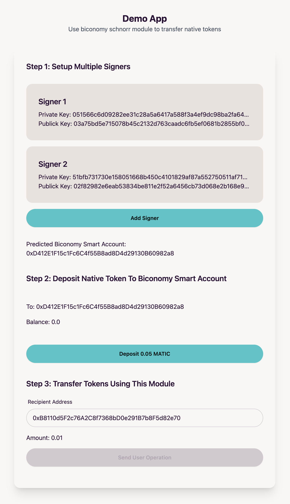

# biconomy-schnorr-module

This is the Biconomy Schnorr module that uses Schnorr signatures validation. You can aggregate signatures into N/N multi-signatures that can be verified on-chain for about the same gas cost as a regular ECDSA signature!

#### Why use Schnorr signatures?

Multi-signatures is one of the most powerful elements in Web3.<br>
It can be used by DAOs but also by individuals to improve their security.<br>
For example, you can use it to sign transactions from your laptop and your mobile, like 2FA.<br>
<br>
Schnorr signatures is an on-chain verifiable, easy to implement and very flexible signature scheme. The on-chain verification cost is as cheap as ecrecover.<br>
<br>
More details here, ["Schnorrkel.js: Efficient Multi-sigs via Schnorr Signatures"](https://hackmd.io/@0xbobby/rkIGEBVb2)<br>

####  Live Demo

https://biconomy-schnorr-module.vercel.app/



####  Demo Video

https://youtu.be/VveeF-_OxMc

## Basic Usage

```typescript
import {
  SchnorrSigner,
  SchnorrValidationModule,
} from "schnorr-validation-module";
import {
  BiconomySmartAccountV2,
  DEFAULT_ENTRYPOINT_ADDRESS,
} from "@biconomy/account";
import { ChainId } from "@biconomy/core-types";
import { IBundler, Bundler } from "@biconomy/bundler";
import { IPaymaster, BiconomyPaymaster } from "@biconomy/paymaster";
import { ethers } from "ethers";

const bundler: IBundler = new Bundler({
  //https://dashboard.biconomy.io/
  bundlerUrl:
    "https://bundler.biconomy.io/api/v2/80001/nJPK7B3ru.dd7f7861-190d-41bd-af80-6877f74b8f44",
  chainId: ChainId.POLYGON_MUMBAI,
  entryPointAddress: DEFAULT_ENTRYPOINT_ADDRESS,
});

const paymaster: IPaymaster = new BiconomyPaymaster({
  //https://dashboard.biconomy.io/
  paymasterUrl:
    "https://paymaster.biconomy.io/api/v1/80001/bN77UefF7.145fff89-e5e1-40ec-be11-7549878eb08f",
});

const signerOne = new SchnorrSigner();
const partnerSigners = [new SchnorrSigner(), new SchnorrSigner()];
const signers = [signerOne, ...partnerSigners];
const signerPublicKeys = signers.map((signer) => signer.publicKey);
const signerPublicNonces = signers.map((signer) => signer.publicNonces);

const schnorrModule = await SchnorrValidationModule.create({
    signer: signerOne,
    publicKeys: signerPublicKeys,
    publicNonces: signerPublicNonces,
});

const biconomySmartAccount = await BiconomySmartAccountV2.create({
    chainId: ChainId.POLYGON_MUMBAI,
    bundler: bundler,
    paymaster: paymaster,
    entryPointAddress: DEFAULT_ENTRYPOINT_ADDRESS,
    defaultValidationModule: schnorrModule,
    activeValidationModule: schnorrModule,
});

// NOTE: You need to fund the smart account with a Native Token (e.g. ETH, MATIC, etc.) before you can send a user operation.
const accountAddress = await biconomySmartAccount.getAccountAddress()

const op = await accountAPI.buildUserOp([
    {
        to: "0x...",
        value: ethers.utils.parseEther("0.01"),
    },
]);
const opHash = await accountAPI.getUserOpHash(op);
const partnerSignatures = partnerSigners.map((signer) => {
    const { signature } = signer.multiSignMessage(
        opHash,
        publicKeys,
        publicNonces
    );
    return signature;
});

await accountAPI.sendUserOp(op, {
    partnerSignatures,
} as any);
```

* The above example demonstrates how to use the Schnorr Validation Module.
* The sample code for the demo application is [here](packages/demo-app/src/App.tsx).


## Architecture Overview


* The signers each perform a signature.
* The Schnorr Validation Module aggregates the signatures into one and sends the user operation to the bundler.

## Supported Networks

| Network | Address |
----|---- 
| Goerli | [0x6523e21c4bca777055393bb4a99b13665bf513c2](https://goerli.etherscan.io/address/0x6523e21c4bca777055393bb4a99b13665bf513c2) |
| Polygon Mumbai | [0x6523e21c4bca777055393bb4a99b13665bf513c2](https://mumbai.polygonscan.com/address/0x6523e21c4bca777055393bb4a99b13665bf513c2) |
| Arbitrum Goerli |[0x6523e21c4bca777055393bb4a99b13665bf513c2](https://arbiscan.io/address/0x6523e21c4bca777055393bb4a99b13665bf513c2) |
| Optimism Goerli | [0x6523e21c4bca777055393bb4a99b13665bf513c2](https://goerli-optimism.etherscan.io/address/0x6523e21c4bca777055393bb4a99b13665bf513c2) |
| Avalanche Fuji | [0x6523e21c4bca777055393bb4a99b13665bf513c2](https://testnet.snowtrace.io/address/0x6523e21c4bca777055393bb4a99b13665bf513c2) |
| Celo Alfajores | [0x6523e21c4bca777055393bb4a99b13665bf513c2](https://alfajores.celoscan.io/address/0x6523e21c4bca777055393bb4a99b13665bf513c2) |

## Development

### Smart Contracts

To run tests

```bash
$cd packages/schnorr-validation-module/
$pnpm run test
```

To deploy

```bash
$cd packages/schnorr-validation-module/
$forge script ./script/SchnorrValidationModule.s.sol -f $RPC_URL  --broadcast
```

### Demo App

To run the demo app

```bash
$cd packages/demo-app/
$pnpm run dev
```


## License

This app is open-source and licensed under the MIT license. For more details, check the [License file](LICENSE).


## Reference

* [Biconomy Module](https://docs.biconomy.io/category/modules)
* [Schnorrkel.js](https://hackmd.io/@0xbobby/rkIGEBVb2)

