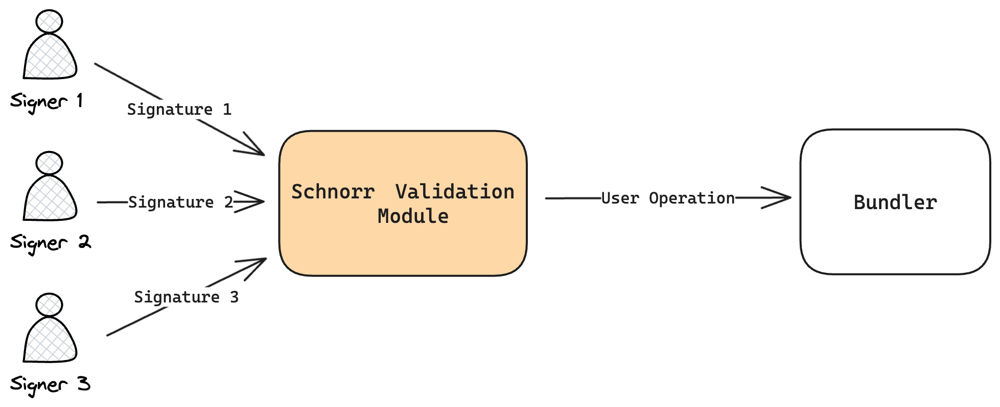

# biconomy-schnorr-module

## Description

This is a module to demonstrate the use of Schnorr signature in Biconomy Module.<br>
You can aggregate signatures to form N/N multisignatures that can be verified on-chain.<br>
This enables Biconomy Smart Wallets to verify Schnorr signatures on-chain for about the same gas cost as a regular ECDSA signature!

## Live Demo

https://biconomy-schnorr-module.vercel.app/

## Demo Video

https://youtu.be/VveeF-_OxMc

## Architecture Overview



* The signers each perform a signature.
* The Schnorr Validation Module aggregates the signatures into one and sends the user operation to the bundler.

## Usage

The following example demonstrates how to use the Schnorr Validation Module.

```typescript

const signerOne = new SchnorrSigner();
const partnerSigners = [new SchnorrSigner(), new SchnorrSigner()];
const signers = [signerOne, ...partnerSigners];
const signerPublicKeys = signers.map((signer) => signer.publicKey);
const signerPublicNonces = signers.map((signer) => signer.publicNonces);

const schnorrModule = await SchnorrValidationModule.create({
    signer: signerOne,
    publicKeys: signerPublicKeys,
    publicNonces: signerPublicNonces,
});

const biconomySmartAccount = await BiconomySmartAccountV2.create({
    chainId: ChainId.POLYGON_MUMBAI,
    bundler: bundler,
    paymaster: paymaster,
    entryPointAddress: DEFAULT_ENTRYPOINT_ADDRESS,
    defaultValidationModule: schnorrModule,
    activeValidationModule: schnorrModule,
});

// NOTE: You need to fund the smart account with a Native Token (e.g. ETH, MATIC, etc.) before you can use it.
const accountAddress = await biconomySmartAccount.getAccountAddress()

const op = await accountAPI.buildUserOp([
    {
        to: "0x...",
        value: ethers.utils.parseEther("0.01"),
    },
]);
const opHash = await accountAPI.getUserOpHash(op);
const partnerSignatures = partnerSigners.map((signer) => {
    const { signature } = signer.multiSignMessage(
        opHash,
        publicKeys,
        publicNonces
    );
    return signature;
});

await accountAPI.sendUserOp(op, {
    partnerSignatures,
} as any);
```

## License

This app is open-source and licensed under the MIT license. For more details, check the [License file](LICENSE).


## Reference

* [Biconomy Module](https://docs.biconomy.io/category/modules)
* [Schnorrkel.js](https://hackmd.io/@0xbobby/rkIGEBVb2)

